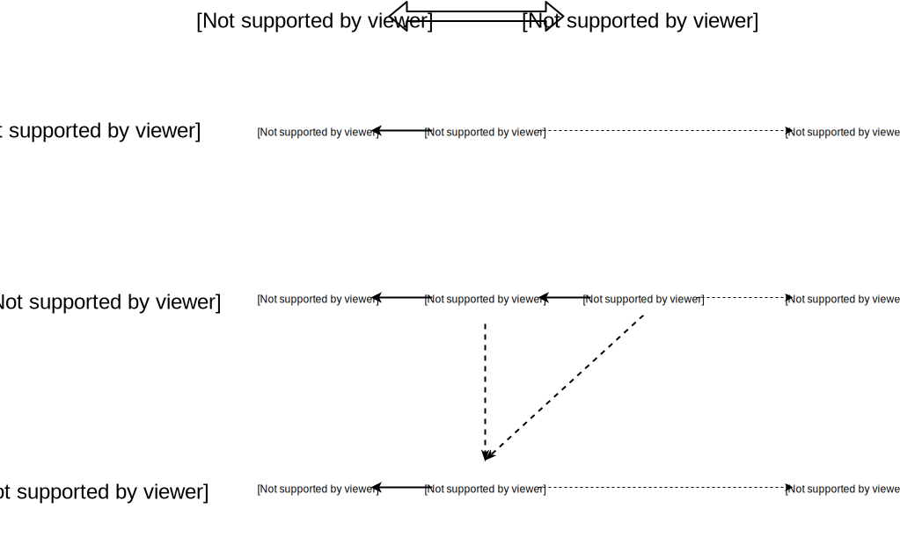

### Yrola - A column database for random writes in Rust

Stefan O'Rear

<sorear2@gmail.com>

<stefan@gudtech.com>

https://github.com/sorear/yrola

---

## Who am I

Stefan O'Rear: math/CS geek, likes rainy days, avoids the Sun.  Probably not a vampire.

Long interested in mathematics, databases, and compilers

Wrote the Niecza Perl 6 compiler

---

## The Use Case

* Alice works at FooCorp - They ship millions of widgets per day across the globe
* We want Alice to be able to count the pencils that her company shipped to Uganda yesterday
* We need a database with *fast bulk reads* / she's not going to wait an hour
* We need a database with *efficient random writes* / New data is loaded constantly

---

## What we've studied

* Row databases (MySQL): very reliable, fast writes, reads are too slow
* Vertica/Vectorwise: fast, big hardware, expensive, closed source
* Several Hadoop-based options exist
* MonetDB: Actually pretty close, but…

---

## MonetDB

* Quite mature system, developed in 2002 at CWI
* Designed for science applications / post-facto analysis of constant data
* Extremely fast - 1000x faster than MySQL for analytics queries

---

## Baseline column store

---

## How MonetDB works

* Assumption: the bus is the bottleneck
  * Access less data - only read the columns you use
  * Sequential access for both memory and disk
* Each column of a table is a single dense vector stored as one mmapped file
  * An int column is 4 bytes per row - process 109 rows per second
* Simplicity: stores the columns on disk and in memory using the same format
  * Works almost as well when data exceeds ram

---

## Why is that a problem

* Monet uses a single flat vector for each column
* To update a column, you have to write in the middle
  * Concurrent readers are a hassle to deal with
  * I think MonetDB is rewriting the whole column
* To update 100 columns in one row, that's 100 random writes of 4 bytes each
* VERY SLOW UPDATES!  Especially on rotating media
* And we have many updates per second...

---

## A proposal

* MonetDB represents each SQL table as one vector file per column.

* Yrola represents each SQL table as a stack of transparent _layers_
  * Each layer looks a lot like a MonetDB table
  * Each layer contains a subset of the rows
  * Some layers will be very small and we make effort to optimize that

---

## Layer structure

---

## Layers are like UNIONs

* Each row may have different versions in one or more layers
    * The newest/topmost layer takes precedence
* The latest version of the row is visible in queries
    * It may be a deletion marker
    * Older versions are always obsolete

---

## Efficient updates

* In-place modification of MonetDB tables is slow
  * Yrola implements updates by adding a new layer to the top of the stack.
  * Efficient because we're only writing a small amount

---

## Query time!

* To query, we combine the layers in memory
  * This is a kind of join MonetDB is already good at
  * Not significantly more than we'd have read anyway

---

## Housekeeping

* Lots of layers slow down queries
  * Periodically we consolidate layers downward
  * Merging large layers is expensive but infrequent

---

## There is precedent for this!

* In OLTP databases (LevelDB, Couchbase, ...) this is called "log structured merge trees"

---

## Why Rust?

* Memory safe - MonetDB is kinda crashy
* Control over free() timing - use a lot of memory well
* Efficient

---

## Status

* Journal layer seems to work
* Vector handling in progress
* Table handling in progress
* Frontend not started

---

## Bonus round

* Time series data
* Highly specialized databases exist, but Yrola is actually quite passable
* If you're spreading appends between 60k+ logs, that's basically random write

---

## Thanks

email: sorear2@gmail.com

yrola: https://github.com/sorear/yrola
